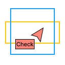

  

<h1 align="center">
   Figma ML
</h1>

<h3 align="center">
  A Design System Plugin Made with TensorFlow JS - like spell check for design systems
</h3>

	
	
	

## Overview

A project using [TensorFlow JS](https://www.tensorflow.org/js) to create the `spell check` of design systems, that helps designers by keep-watching numerous design elements instead of humans. You can install and try this on the Figma Community [here](https://www.figma.com/community/plugin/1049316538308913961/Figma-ML). 

The best way to illustrate this is to see it in action via the animation below:

 

## Quickstart
* Run `yarn` to install dependencies.
* Run `yarn build:watch` to start webpack in watch mode.
* Open `Figma` -> `Plugins` -> `Development` -> `New Plugin...` and choose `manifest.json` file from this repo.

⭐ To change the UI of your plugin (the react code), start editing [App.tsx](./src/app/components/App.tsx).  
⭐ To interact with the Figma API edit [controller.ts](./src/plugin/controller.ts).  
⭐ Read more on the [Figma API Overview](https://www.figma.com/plugin-docs/api/api-overview/).

## Toolings

This plugin is built using [Figma plugin React Template](https://github.com/nirsky/figma-plugin-react-template) by [Nir Hadassi](https://github.com/nirsky). It's an excellent boilerplate for new Figma plugins and includes a ton of useful utilities. Check out the Figma plugin API docs to learn more about writing plugins. This repo is using:

* React + Webpack
* TypeScript
* Prettier precommit hook

## Contributors 

- [JooHyung Park](https://github.com/dusskapark)
- [JeongHyun Yoon](https://github.com/ave10987)
- [JinJae Lee](https://github.com/jinbread)
- [JongHee Woo](https://github.com/JongheeWoo)

## License

This project is licensed under the terms of the [MIT](./LICENSE.md).
